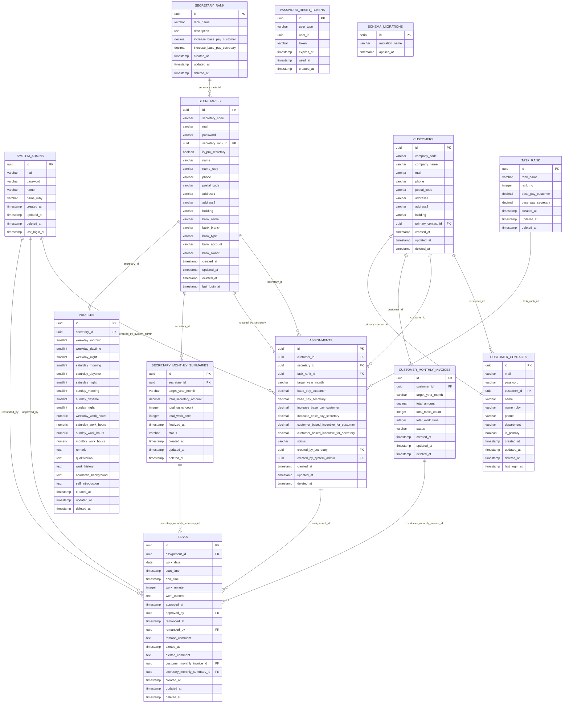

```mermaid
erDiagram
    SYSTEM_ADMINS {
        uuid id PK
        varchar mail
        varchar password
        varchar name
        varchar name_ruby
        timestamp created_at
        timestamp updated_at
        timestamp deleted_at
        timestamp last_login_at
    }

    SECRETARY_RANK {
        uuid id PK
        varchar rank_name
        text description
        decimal increase_base_pay_customer
        decimal increase_base_pay_secretary
        timestamp created_at
        timestamp updated_at
        timestamp deleted_at
    }

    SECRETARIES {
        uuid id PK
        varchar secretary_code
        varchar mail
        varchar password
        uuid secretary_rank_id FK
        boolean is_pm_secretary
        varchar name
        varchar name_ruby
        varchar phone
        varchar postal_code
        varchar address1
        varchar address2
        varchar building
        varchar bank_name
        varchar bank_branch
        varchar bank_type
        varchar bank_account
        varchar bank_owner
        timestamp created_at
        timestamp updated_at
        timestamp deleted_at
        timestamp last_login_at
    }

    CUSTOMERS {
        uuid id PK
        varchar company_code
        varchar company_name
        varchar mail
        varchar phone
        varchar postal_code
        varchar address1
        varchar address2
        varchar building
        uuid primary_contact_id FK
        timestamp created_at
        timestamp updated_at
        timestamp deleted_at
    }

    CUSTOMER_CONTACTS {
        uuid id PK
        varchar mail
        varchar password
        uuid customer_id FK
        varchar name
        varchar name_ruby
        varchar phone
        varchar department
        boolean is_primary
        timestamp created_at
        timestamp updated_at
        timestamp deleted_at
        timestamp last_login_at
    }

    TASK_RANK {
        uuid id PK
        varchar rank_name
        integer rank_no
        decimal base_pay_customer
        decimal base_pay_secretary
        timestamp created_at
        timestamp updated_at
        timestamp deleted_at
    }

    ASSIGNMENTS {
        uuid id PK
        uuid customer_id FK
        uuid secretary_id FK
        uuid task_rank_id FK
        varchar target_year_month
        decimal base_pay_customer
        decimal base_pay_secretary
        decimal increase_base_pay_customer
        decimal increase_base_pay_secretary
        decimal customer_based_incentive_for_customer
        decimal customer_based_incentive_for_secretary
        varchar status
        uuid created_by_secretary FK
        uuid created_by_system_admin FK
        timestamp created_at
        timestamp updated_at
        timestamp deleted_at
    }

    CUSTOMER_MONTHLY_INVOICES {
        uuid id PK
        uuid customer_id FK
        varchar target_year_month
        decimal total_amount
        integer total_tasks_count
        integer total_work_time
        varchar status
        timestamp created_at
        timestamp updated_at
        timestamp deleted_at
    }

    SECRETARY_MONTHLY_SUMMARIES {
        uuid id PK
        uuid secretary_id FK
        varchar target_year_month
        decimal total_secretary_amount
        integer total_tasks_count
        integer total_work_time
        timestamp finalized_at
        varchar status
        timestamp created_at
        timestamp updated_at
        timestamp deleted_at
    }

    TASKS {
        uuid id PK
        uuid assignment_id FK
        date work_date
        timestamp start_time
        timestamp end_time
        integer work_minute
        text work_content
        timestamp approved_at
        uuid approved_by FK
        timestamp remanded_at
        uuid remanded_by FK
        text remand_comment
        timestamp alerted_at
        text alerted_comment
        uuid customer_monthly_invoice_id FK
        uuid secretary_monthly_summary_id FK
        timestamp created_at
        timestamp updated_at
        timestamp deleted_at
    }

    PROFILES {
        uuid id PK
        uuid secretary_id FK
        smallint weekday_morning
        smallint weekday_daytime
        smallint weekday_night
        smallint saturday_morning
        smallint saturday_daytime
        smallint saturday_night
        smallint sunday_morning
        smallint sunday_daytime
        smallint sunday_night
        numeric weekday_work_hours
        numeric saturday_work_hours
        numeric sunday_work_hours
        numeric monthly_work_hours
        text remark
        text qualification
        text work_history
        text academic_background
        text self_introduction
        timestamp created_at
        timestamp updated_at
        timestamp deleted_at
    }

    PASSWORD_RESET_TOKENS {
        uuid id PK
        varchar user_type
        uuid user_id
        varchar token
        timestamp expires_at
        timestamp used_at
        timestamp created_at
    }

    SCHEMA_MIGRATIONS {
        serial id PK
        varchar migration_name
        timestamp applied_at
    }

    SECRETARY_RANK ||--o{ SECRETARIES : "secretary_rank_id"
    SECRETARIES ||--o{ ASSIGNMENTS : "secretary_id"
    SECRETARIES ||--o{ ASSIGNMENTS : "created_by_secretary"
    SECRETARIES ||--o{ SECRETARY_MONTHLY_SUMMARIES : "secretary_id"
    SECRETARIES ||--o| PROFILES : "secretary_id"

    SYSTEM_ADMINS ||--o{ ASSIGNMENTS : "created_by_system_admin"
    SYSTEM_ADMINS ||--o{ TASKS : "approved_by"
    SYSTEM_ADMINS ||--o{ TASKS : "remanded_by"

    CUSTOMERS ||--o{ CUSTOMER_CONTACTS : "customer_id"
    CUSTOMER_CONTACTS ||--o| CUSTOMERS : "primary_contact_id"
    CUSTOMERS ||--o{ ASSIGNMENTS : "customer_id"
    CUSTOMERS ||--o{ CUSTOMER_MONTHLY_INVOICES : "customer_id"

    CUSTOMER_MONTHLY_INVOICES ||--o{ TASKS : "customer_monthly_invoice_id"
    SECRETARY_MONTHLY_SUMMARIES ||--o{ TASKS : "secretary_monthly_summary_id"

    TASK_RANK ||--o{ ASSIGNMENTS : "task_rank_id"
    ASSIGNMENTS ||--o{ TASKS : "assignment_id"
```
